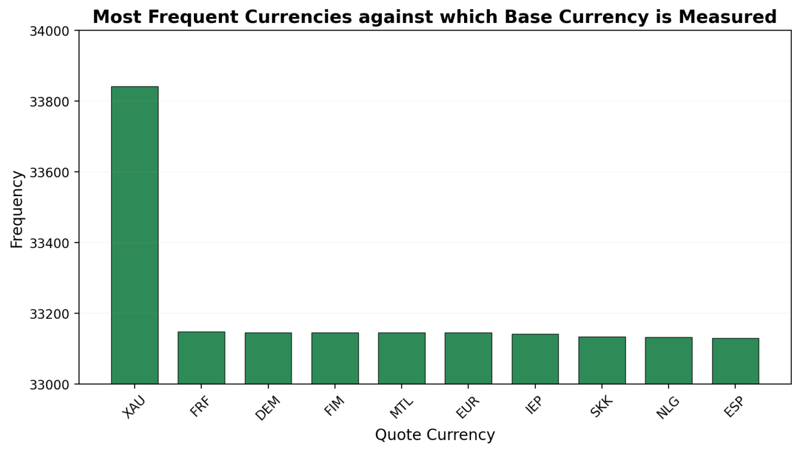
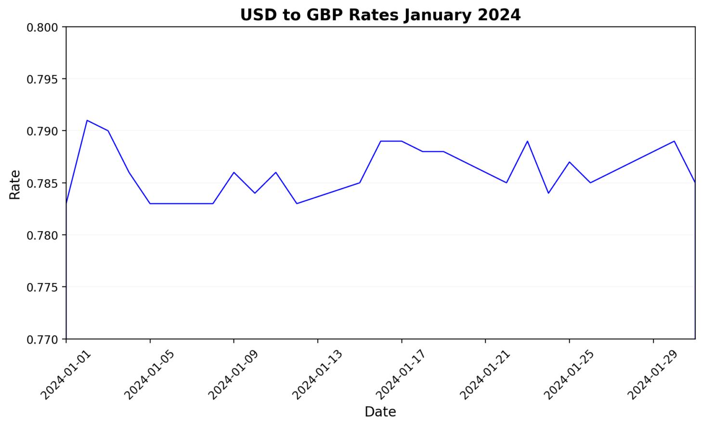

# RLAM - Training Session

## Overview
This course has been designed to give RLAM employees an overview of Python and how it
can be used with Snowflake to sort, analyse, and visualise data. By the end of the session,
trainees should be able to access data using Snowflake and perform queries on that data
which enable them to effectively work with the data set. They should also be able to use the
Charts functionality on Snowflake to visualise that data. Finally, they will be able to use
Matplotlib to refine their visualisations.

1. Introduction
2. Python Basics
3. Checking our Dataset
4. Visual 1
   - SQL
   - Python
   - Matplotlib
5. Visual 2
   - SQL
   - Python
   - Matplotlib
6. Visual 3
   - SQL
   - Python
   - Matplotlib

## Introduction

1. Welcome to the session. Explain that, by the end of the session you should be able to:
   - Access data using Snowflake
   - Perform queries on that data
   - Visualise that data
2. **Explain** that we're going to utilise something called a **Notebook** within a piece of software called **Snowflake** that allows users to store, access, and exchange data. It is a cloud-based data platform that provides solutions for data warehousing, data lake management, data engineering, data sharing, and business intelligence. It allows organizations to store and analyze large volumes of structured and semi-structured data using a scalable and secure architecture.
3. **Highlight** that the session is designed to be a code-along - you should be able to type out most commands, but I'll share any long ones in the chat
4. We'll build the Notebook collaboratively over the course of the session and, by the end, will have a set of shareable notes going through everything that we've covered
5. **Insert** visuals that are where we're going to get to **TO COMPLETE**

   **Explain** that, in the session, we're going to look to create three pieces of data analysis and accompanying visuals:
   - Analysing the most frequent currency against which base currency is measured
   - Analysing the rate of exchange between GBP and USD across a month
   - Analysis of the performance of the USD against four other currencies between 2022-24 
7. **Open** Snowflake and log-in
8. **Navigate** to `Notebooks` tab > `Go to Notebooks` > `+ Notebook`
9. **Double check** that trainees can see a list of accessible databases on the left-hand panel
10. **Explain** next steps:
   - You should be able to see three **cells** - these are essentially mini-tutorials but this session will cover many of these points so we're not going to use these for now
   - **Delete** `Cells 2 and 3` from the notebook (with the SQL commands and Panda dataframe)
   - **Leave** `Cell 1` - we're going to talk through that now...
11. **Explain** what they can see in `Cell 1`:
      - It is written in **Python**
      - Some **libraries** are `imported` at the top of the cell. A **library** is a collection of code that can make everyday tasks more efficient
      - Explain that, later on, we're going to be using a library called `Matplotlib` to help us do some visualisations
      - **Explain** that we're also going to use the `Pandas` library that's there
      - Pandas is a Python library used for working with data sets. It has functions for analysing, cleaning, exploring, and manipulating data
      - Transfer your attention to **line 7** which intoduces **Snowpark**
      - Explain that **Snowpark** is a developer framework provided by Snowflake, enabling users to write data pipelines, data transformations, and other complex operations in Python, Java, or Scala directly within Snowflake
      - So `Cell 1` is setting things up so that we can use **Python** within this session

## Python Basics

1. **Explain** that, in order, to be able to work with the data that we have available to us, we're going to need to learn some Python
2. Get the unsaid question out of the way - yes, it is named after **Monty Python**
3. **Explain** that it's a simple to use programming language that can:
   - be used to create web applications
   - be used to connect to database systems
   - be used to handle big data and perform complex mathematics
4. All in all - it's useful for the sorts of things that we're going to want to do in Snowflake
5. **Create** the following cell:
```
# Zen of Python
import this
```
   - **Explain** that the `#` indicates a note - we'll be using these throughout the session, so that you are able to remember what we are trying to illustrate in each section
   - **Demonstrate** that we can also **label** the cell which is going to be useful to remind us what each cell contains
   - **Run** the `import this` line
   - **Explain** that the resultant **Zen of Python** is a sort of 'code of conduct' for the way the language should be written
   - **Congratulate people** - they've just written their first line of code!
6. **Demonstrate** that you can 'collapse' cells by clicking **Display Options**
7. **Explain** that an alternative is to simply try all of these bits out in the same cell
8. **Remind** people that we will be sending out a completed **notebook** at the end of this session so if you want to clear this one, that's fine!

### Python Basics - Variables

1. **Explain** that a **variable** is just a named storage location that holds a value
2. **Explain** that you can then access the value by referencing the variable
3. **Create** the following cell:
```
# Variables
age = 5
name = 'Simon'
```
4. **Run** the `cell` - notice that nothing happens - we're going to need a key word:
```
# Variables
age = 5
name = 'Simon'
print(name, age)
```
5. **Ask** trainees to create **two** variables of their own and print them
6. **Ask** a volunteer to walk you through writing and printing two different variables

### Python Basics - Data Types

1. **Point out** that the numbers in the previous exercise did not use quotation marks, but the names did - why?
2. **Answer** these are examples of different data types
3. **Demonstrate** this by showing a new key word:
```
age = 5
name = 'Simon'
type(name)
```
4. **Highlight** that this returns a lot of information - the key piece (for now) is at the top though - `name` is a `string`
5. **Ask** trainees how they would check what data type age is?
6. **Congratulate** the volunteer that says:
```
age = 5
name = 'Simon'
type(age)
```
7. **Highlight** that this is an `integer`
8. **Explain** that we're going to do a few examples, I'll create the variable and you check it
9. **Type** each of the following, in turn and get a volunteer to check the data type:
   - `x = 3.14` should be a `float`
   - `y = True` should be a `bool`
   - `z = ['apple', 'banana', 'pear']` should be a `list`
10. **Ask** what happens if they type:
```
z = ['apple', 'banana', 'pear']
print(z[1])
```
11. **Congratulate** the volunteer that points out that it returns `banana` and explain that this is because, when we code - we start counting from 0
12. **Explain** that we can do all sorts of things with data types - in fact we could just spend two hours right here doing them, but we're going to look at `strings` in particular...

### Python Basics - Strings

1. **Remind** trainees that a `string` is a data type used to represent a sequence of characters, such as words or sentences
2. **Explain** that `strings` can be surrounded by '' or ""
3. **String Literals** are a fun way to play with strings and insert them into something else - this is a concept called **concatenation** - here we're going to be using `f-string` notation to replace variables with their values
4. **Create** the following cell:
```
# String Literals
name = 'Elizabeth'
city = 'London'

print(f'I am {name}, and I live in {city}.')
```
5. **Point out** that these principles should start to give us a sense that we can change and alter things using Python

### Python Basics - String Methods

1. **Ask** trainees once again how to check the data type of a variable
2. **Congratulate** the volunteer who says `type(variable)`
3. **Create** the following cell:
```
# String Methods
name = 'indiana jones'
profession = 'archaeologist'
type(name)
```
4. **Highlight** the methods that appear on the screen and explain that these are all essentialy **mini built-in functions** that will give you certain information about the string
5. **Point out** that I'm going to use the command `print` a lot in this session - this is just to make it clear what I'm doing. In reality, though - you only really use `print` for checking things - you wouldn't see it in a final piece of code
6. **Demonstrate** how you would use some of these methods and show what you mean about `print`:
```
# String Methods - Capitalize
name = 'indiana jones'
profession = 'archaeologist'
name.capitalize()
```
7. **Feign annoyance** that the `j` is not capitalised then demonstrate `Title`
8. **Explain** that this happens all the time - a database is made up of millions of entries of, say, names and they're typed in in different ways - esssentially what we could do here is loop through each entry and apply a method like `Title` to it in order to ensure that our formatting was universal throughout:
```
# String Methods - Title
name = 'indiana jones'
profession = 'archaeologist'
print(name.title())
```
8. **What about** if we want to find out how many of a certain letter are in `profession`?
```
# String Methods - Count
name = 'indiana jones'
profession = 'archaeologist'
print(profession.count('a'))
```
9. **Or** if I realised I was actually talking about my friend Matt Jones?
```
# String Methods - Replace
name = 'indiana jones'
profession = 'archaeologist'
print(name.replace('indiana', 'matt'))
```
10. **And** what if I wanted to make sure his name was capitalized in the same code block?
```
# Chaining Methods
name = 'indiana jones'
profession = 'archaeologist'
print(name.replace('indiana', 'matt').title())
```
11. **Challenge** trainees to use the `Index` method to find what position the 'o' is in the word `archaeologist`
12. **Congratulate** the person who comes up with:
```
# String Methods - Index
name = 'indiana jones'
profession = 'archaeologist'
print(profession.index('o'))
```
13. **Ask** what happens when we change the previous cell to use the `split` method?
14. **Congratulate** the volunteer that notices that we're manipulating the string and we've returned a `list`
```
# String Methods - Index
name = 'indiana jones'
profession = 'archaeologist'
print(profession.split('o'))
```
Should return:
`['archae', 'l', 'gist']`

### Python Basics - Functions

1. **Point out** that we've already established that `methods` are mini functions
2. **Of course**, not all functions are built in - sometimes we have to write our own
3. **Explain** that we're not going to spend a long time on functions, but we are going to look at some syntax
4. **Create** the following cell:
```
# Functions
def my_function():
  print('Hello from a function')

# To call this function
my_function()
```
5. **Explain** that `def` is a key word - it **defines** our function
6. **Explain** that we `call` the function at the end so that we can generate the result
7. **Explain** that we've used `print` in the example, but we could also `return` the output too
8. **Explain** that this would return (but not necessarily **display**) the output of the function
9. **Explain** that we can pass information into functions as **arguments**
10. **Create** the following cell:
```
# Functions
def my_function(lotr_name):
  print(f'Hello {lotr_name}!!')

my_function('Arwen')
my_function('Legolas')
my_function('Elrond')
```
11. **Explain** that we can also use Python's **Operators** to perform, say, maths within functions:
```
# Operators
a = 7
b = 3

def my_function():
   print(a * b)

my_function()
```
12. **Explain** that that's the end of our whistle-stop tour around Python. It's time to start applying some of our core knowledge to manipulate data...
13. **Pause** Q&A
14. **BREAK**

## Checking our Dataset

1. **Explain** that it's time to start working with some actual data
2. **Explain** that we're going to use some of their previous training first of all and utilise SQL to first connect to, and then check our data set
3. **Explain** that we're going to clear our Python - we don't need it for now
4. **Remind** people that our notebook is set in its own database. The beauty of Snowflake is that we can connect this to a different database which is what we're going to do...
5. **Create** the following **SQL** cell which is going to **connect** our notebook to the database that we want to use - we're going to do this with the `USE SCHEMA` key term:
```
# Connecting the Database
USE SCHEMA TRAINING_ACCOUNT_DATA.DEV_SMNTC_LAYER_IBOR;
```
6. **Demonstrate** the fact that, we can run this command and we get a `Successful Execution` message
7. **Demonstrate** that we can now have a look at our data. **Create** a new **SQL** cell:
```
# Displaying the Data
SELECT * FROM FXRATE
```
8. **Talk** trainees through the data - focusing on the size of the set, the fact that some information appears to be more useful than other information etc.
9. **Explain** that, SQL is really useful to 'trim the fat' off big data sets in particular, so, what we're going to do is use it to get our data set trimmed down to something that we can work with more easily
10. **Remind** trainees that we're going to build 3 bits of data analysis and visuals:
   - Analysing the most frequent currency against which base currency is measured
   - Analysing the rate of exchange between GBP and USD across a month
   - Analysis of the performance of the USD against four other currencies between 2022-24

## VISUAL 1 - Analysing the most frequent currency against which base currency is measured
### VISUAL 1 - The Data
1.. **Explain** that we're going to construct our code in a new **Python** cell.
2. **Explain** that, whilst SQL is excellent for many pieces of data analysis, Python gives us additional functionality (which we will only scratch the surface of today)
3. **Use** `Packages` to search for, and import `Matplotlib` - allow everything to **update**
4. **Explain** that, we're going to need to ensure that we've created the right environment to create our visuals. To do that, we're going to edit `Cell 1`:
```
# Import python packages
import pandas as pd
import matplotlib.pyplot as plt

# We can also use Snowpark for our analyses!
from snowflake.snowpark.context import get_active_session
from snowflake.snowpark.functions import col, avg, date_trunc, round, count
session = get_active_session()
```
5. **Explain** that here we are:
   - Keeping the `Pandas` library which is used for data analysis
   - Importing the `Matplotlib` library which is used for data visualisation (you may have to add this as a Package using the `Packages` tab at the top
   - Removing `Streamlit` as we're not going to use this in this session
   - Importing some core functionality from `Snowpark` in the form of methods - `col`, `avg`, `date_trunc`, `round`, `count`
6. **Re-run** `Cell 1` to ensure all of these dependencies load into our notebook
7. **Create** the following **Python** cell:
```
# Visual 1 
fx_data = session.sql("""
    SELECT base_currency, currency_pair, fx_rate_base_currency, quote_currency, rate_date,
    FROM fxrate
""")
```
7. **Explain** that we're injecting some SQL into the Python file here to start us off in narrowing down our query.
8. **Explain** that we're storing that SQL in a `variable` called `starter` - we're now going to call on that variable and manipulate it
9. **Adapt** the main cell as follows:
```
# Visual 1 
fx_data = session.sql("""
    SELECT base_currency, currency_pair, fx_rate_base_currency, quote_currency, rate_date,
    FROM fxrate
""")

def frq(): 
    quote_curr = (
        fx_data
        .group_by('quote_currency')
        .agg(count('*').alias('frequency'))
        .sort(col('frequency'), ascending=False)
        .limit(10)
    )

    return quote_curr

frq()
```
10. **Take** trainees through the above, line-by-line:
   - First we create a variable `quote_curr`
   - Then we use our SQL variable `starter`
   - For Python queries we will use some of the methods that Snowflake has available - in this case it will be `group_by` (we want to collate information), then we pass which column we want to group `quote_currency`
   - After `group_by`, we use `agg` and `count`
   - `count` is a Snowpark function that was imported in `cell 1`
   - `count` will count all '*' quote_currency and will aggregate all of them
   - Then we create an `alias` called `frequency`, that will became a new column with the `agg()` values
   - We use the `sort` method to sort our col (another Snowpark function) frequency and we want it to show from the most `quote_currency` used to the least `(ascending=False)`
   - The last section of the function is a limit of 10 - we'll need this in order to prevent the resultant visual being overpopulated
   - Finally we have to `return` the data and call the function
11. **Run** the above - demonstrate that we have a ten row table - who had guessed that Gold (XAU) was going to be the currency against which currencies were most frequently compared?

### VISUAL 1 - The Visual
1. **Explain** that, now that we have the data - we're going to do something with it
2. **Matplotlib** is a library that gives you a huge number of visuals that we're going to use to create our first chart
3. **Demonstrate** the [Matplotlib documentation](https://matplotlib.org/stable/plot_types/index.html) to show the range of charts - **point out** that for each, there are implementation `code blocks`
4. **Go back** to our **Notebook** and create a new **Python** cell:
```
# Visual 1 - Get and Store Data
my_df = cell4.to_pandas()

quote_curr = my_df['QUOTE_CURRENCY']
frq = my_df['FREQUENCY']
```
5. **Explain** that in the first instance, we need to get the data we've created in the previous cell (**CHECK** THAT `CELL4` IS THE CORRECT REF!) and store the relevant data in two variables - `quote_curr` and `frq` - remind trainees that we are using [] as we are effectively accessing a **list** of data headings
6. **Demonstrate** that we're then going to use `Matplotlib` to create a chart based on that data. To do this, we're just going to use a `code block` like the ones we just saw on the documentation:
```
# Visual 1 - Show Data
my_df = cell4.to_pandas()

quote_curr = my_df['QUOTE_CURRENCY']
frq = my_df['FREQUENCY']

plt.figure(figsize=(10, 5))
plt.bar(quote_curr, frq, color='seagreen', edgecolor='black', linewidth=0.5, width=0.7)
plt.title('Most Frequent Currencies against which Base Currency is Measured', fontsize=14, fontweight='bold')
plt.xlabel('quote_curr', fontsize=12)
plt.ylabel('frq', fontsize=12)

plt.grid(axis='y', linestyle='-', alpha=0.1)
plt.xticks(rotation=45)

plt.show()
```
7. **Take** trainees through the above code:
   - `figure` is setting the size of the visual
   - `bar` is the type of chart
   - `title` and `labels` are self-explanatory
   - `grid` is adding gridlines
   - `xticks` is manipulating the way text is displayed on the x-axis
8. **Run** this. You should get a visual with no values below c.33,000
9. **Explain** that we could refine this a little by:
   - Relabelling our axes
   - Zooming in on our graph
10. **Alter** the code:
```
# Visual 1 - Show Data
my_df = cell4.to_pandas()

quote_curr = my_df['QUOTE_CURRENCY']
frq = my_df['FREQUENCY']

plt.figure(figsize=(10, 5))
plt.bar(quote_curr, frq, color='seagreen', edgecolor='black', linewidth=0.5, width=0.7)
plt.title('10 Top Quote Currency Frequency', fontsize=14, fontweight='bold')
plt.xlabel('Quote Currency', fontsize=12)
plt.ylabel('Frequency', fontsize=12)
plt.ylim(33000, 34000)

plt.grid(axis='y', linestyle='-', alpha=0.1)
plt.xticks(rotation=45)

plt.show()
```
11. **Explain** that we could refine this even further by using some of our knowledge of string methods and variables
12. **Highlight** that we're accessing the data from the previous cell and using string methods to take out the '_'
13. **Highlight** we could also use `Title` if we wanted to...
14. **Show** what happens when we just alter `axis_font` in the `variables` at the top
```
# Visual 1 - Show Data
my_df = cell4.to_pandas()

quote_curr = my_df['QUOTE_CURRENCY']
frq = my_df['FREQUENCY']
x_label = my_df.columns[0].title().replace('_', ' ')
y_label = my_df.columns[1].title()
axis_font = 12

plt.figure(figsize=(10, 5))
plt.bar(quote_curr, frq, color='seagreen', edgecolor='black', linewidth=0.5, width=0.7)
plt.title('10 Top Quote Currency Frequency', fontsize=14, fontweight='bold')
plt.xlabel(x_label, fontsize=axis_font)
plt.ylabel(y_label, fontsize=axis_font)
plt.ylim(33000, 34000)

plt.grid(axis='y', linestyle='-', alpha=0.1)
plt.xticks(rotation=45)

plt.show()
```
14. **Display** the visual:


## VISUAL 2 - Analysing the rate of exchange between GBP and USD across a month
### VISUAL 2 - The Data
1. **Explain** that we're going to go through the same process for other visuals, bringing more detail in.
2. **Create** a new **Python** cell. **Ask** trainees what we started off with last time and **congratulate** the volunteer who mentions selecting the data using SQL:
```
# Visual 2
fx_data = session.sql("""
    SELECT base_currency, currency_pair, fx_rate_base_currency, quote_currency, rate_date,
    FROM fxrate
    WHERE currency_pair = 'USDGBP'
    AND rate_date 
    BETWEEN '2024-01-01' AND '2024-01-31'
""")

starter.show()
```
3. **Talk through** the above - point out that we're using `WHERE` and `BETWEEN` to narrow down our data set
4. **Run** the result - **highlight** that, whilst useful, there appear to be multiple entries next to each day in January from the same time - if we visualised this, this might get confusing
5. **Explain** that, as we did previously, we're going to use Python to refine our data
6. **First** let's refine our selection by starting to write our function:
```
# Visual 2
fx_data = session.sql("""
    SELECT base_currency, currency_pair, fx_rate_base_currency, quote_currency, rate_date,
    FROM fxrate
    WHERE currency_pair = 'USDGBP'
    AND rate_date 
    BETWEEN '2024-01-01' AND '2024-01-31'
""")

def exchange_rate():
    daily_avg = (
        fx_data
        .select(
            col('base_currency'),
            col('currency_pair'),
            col('fx_rate_base_currency'),
            date_trunc('DAY', col('rate_date')).alias('rate_day')
        )
    )

    return daily_avg

exchange_rate()
```
7. **Walk through** the above, step-by-step:
   - We create a new variable `daily_avg`
   - Then we use our SQL query `starter` and use the `select` method
   - For this query we are selecting three columns: `base_currency`, `currency_pair` and `fx_rate_base_currency`
   - Make sure to use the `col` function, so Python (Snowpark) knows that we are referencing columns
   - Then we use another Snowpark function called `date_trunc`
   - `date_trunc` is commonly used for grouping data by specific date units, in this case we want to group by `DAY` - remember, we are using `DAY` because there is many occurrences throughout the day and we want to make sure it only shows one day at the time
    - Then we pass from which column this date is coming from col('rate_date')
    - Finally we use an alias to make it simple to understand: `rate_day`
8. **Explain** that we still need to refine this further...
```
# Visual 2
fx_data = session.sql("""
    SELECT base_currency, currency_pair, fx_rate_base_currency, quote_currency, rate_date,
    FROM fxrate
    WHERE currency_pair = 'USDGBP'
    AND rate_date 
    BETWEEN '2024-01-01' AND '2024-01-31'
""")

def exchange_rate():
    daily_avg = (
        fx_data
        .select(
            col('base_currency'),
            col('currency_pair'),
            col('fx_rate_base_currency'),
            date_trunc('DAY', col('rate_date')).alias('rate_day')
        )
        .group_by("base_currency", "currency_pair", "rate_day")
        .agg(round(avg("fx_rate_base_currency"), 3).alias("daily_avg_rate"))
        .sort("rate_day")
    )

    return daily_avg

exchange_rate()
```
9. **Explain** the extra bits:
   - Here we are using `group_by`, which organizes the data into groups based on these specified columns
   - `agg` performs an aggregation on the grouped data to calculate the average of the fx_rate_base_currency column for each group
   - The `round()` Snowpark function ensures the average value is rounded to 3 decimal places for precision
   - And the resulting column is renamed to `daily_avg_rate` using the `alias` method
   - We then use `sort` to put results in ascending order
10. **Run** the `cell` and point out that each date now has one, aggregated piece of data which should make visualisation much clearer

### VISUAL 2 - The Visual
1. **Explain** that, as before, we're going to use a new cell to work with `Matplotlib`
2. **Ask** trainees if they can remember what the first things we did last time were
3. **Congratulate** the volunteer who says that we need to think about `Pandas` and `variables`
4. **Start** the **Python** code block off:
```
# Visual 2 - The Visual
my_df = cell4.to_pandas()

rate_day = my_df['RATE_DAY']
daily_avg = my_df['DAILY_AVG_RATE']
```
5. **Point out** that we need to store our intended pieces of data for the `x-axis` and `y-axis` as our variables
6. **Explain** that we're going to use a `stack plot` here to showcase our data
7. **Edit** the cell as follows:
```
my_df = cell4.to_pandas()

rate_day = my_df['RATE_DAY']
daily_avg = my_df['DAILY_AVG_RATE']

plt.figure(figsize=(10, 5))
plt.stackplot(rate_day, daily_avg, color='none', edgecolor='blue', linewidth=1)
plt.title('USD to GBP Rates January 2024', fontsize=14, fontweight='bold')
plt.xlabel('Date', fontsize=12)
plt.ylabel('Rate', fontsize=12)

plt.grid(axis='y', linestyle='-', alpha=0.1)
plt.xticks(rotation=45)

plt.show()
```
8. **Demonstrate** each line - focussing on `title`, `labels` etc.
9. **Run** the resultant graph. You should get something with an inappropriate scale on the `y-axis` and which has a 'gap' at the start and end of the data
10. **Alter** the code:
```
my_df = cell4.to_pandas()

rate_day = my_df['RATE_DAY']
daily_avg = my_df['DAILY_AVG_RATE']

plt.figure(figsize=(10, 5))
plt.stackplot(rate_day, daily_avg, color='none', edgecolor='blue', linewidth=1)
plt.title('USD to GBP Rates January 2024', fontsize=14, fontweight='bold')
plt.xlabel('Date', fontsize=12)
plt.ylabel('Rate', fontsize=12)
plt.xlim(pd.Timestamp('2024-01-01'), pd.Timestamp('2024-01-31'))
plt.ylim(0.77, 0.8)

plt.grid(axis='y', linestyle='-', alpha=0.1)
plt.xticks(rotation=45)

plt.show()
```
11. **Point out** that we are using `xlim` and `ylim` to trim our graph and make it more straightforward to read
12. **Display** the visual:


## VISUAL 3 - Analysis of the performance of the USD against four other currencies between 2022-24
### VISUAL 3 - The Data
```
fx_data = session.sql("""
    SELECT base_currency, currency_pair, fx_rate_base_currency, quote_currency, rate_date,
    FROM fxrate
""")

def comp_usd():
    usd_against = (
        fx_data
        .select(
        col('base_currency'),
        col('quote_currency'),
        col('fx_rate_base_currency'),
        date_trunc('DAY', col('rate_date')).alias('rate_day')
    )
    .where(
        (col('base_currency') == 'USD') 
        & ((col('quote_currency') == 'EUR') 
        | (col('quote_currency') == 'GBP')
        | (col('quote_currency') == 'IEP')
        | (col('quote_currency') == 'CHF'))
    ) 
    .group_by('base_currency', 'quote_currency', 'rate_day')
    .agg(round(avg('fx_rate_base_currency'), 3).alias('avg_rate'))
    .sort("rate_day")
    )
    return usd_against

comp_usd()
```

### VISUAL 3 - The Visual
```
my_df = VISUAL_3_DATA.to_pandas()

import matplotlib.pyplot as plt

# Filter the data for each currency
EUR = my_df[my_df['QUOTE_CURRENCY'] == 'EUR']
GBP = my_df[my_df['QUOTE_CURRENCY'] == 'GBP']
IEP = my_df[my_df['QUOTE_CURRENCY'] == 'IEP']
CHF = my_df[my_df['QUOTE_CURRENCY'] == 'CHF']

# Now we have the filtered data, extract the necessary columns
rate_day_EUR = EUR['RATE_DAY']
rate_day_GBP = GBP['RATE_DAY']
rate_day_IEP = IEP['RATE_DAY']
rate_day_CHF = CHF['RATE_DAY']

# Extract the exchange rate columns for each currency (using 'AVG_RATE')
avg_rate_EUR = EUR['AVG_RATE']
avg_rate_GBP = GBP['AVG_RATE']
avg_rate_IEP = IEP['AVG_RATE']
avg_rate_CHF = CHF['AVG_RATE']

# Plot the data
plt.figure(figsize=(12, 5))

# Plot for EUR
plt.plot(rate_day_EUR, avg_rate_EUR, label='Euro', color='royalblue')

# Plot for GBP
plt.plot(rate_day_GBP, avg_rate_GBP, label='British Pound', color='mediumseagreen')

# Plot for IEP
plt.plot(rate_day_IEP, avg_rate_IEP, label='Irish Pound', color='darkred')

# Plot for CHF
plt.plot(rate_day_CHF, avg_rate_CHF, label='Swiss Franc', color='orange')

# Add labels and title
plt.title('US Dollar Performance 2022-24', fontsize=14, fontweight='bold')
plt.xlabel('Rate Day', fontsize=12)
plt.ylabel('Average Rate', fontsize=12)

# Set x-axis limits
plt.xlim(pd.Timestamp('2022-08'), pd.Timestamp('2024-11'))

# Set y-axis limits 
plt.ylim(0.6, 1.1)

# Customize grid and ticks
plt.grid(axis='y', linestyle='-', alpha=0.1)
plt.xticks(rotation=45)

# Show the plot
plt.legend()
plt.show()
```


